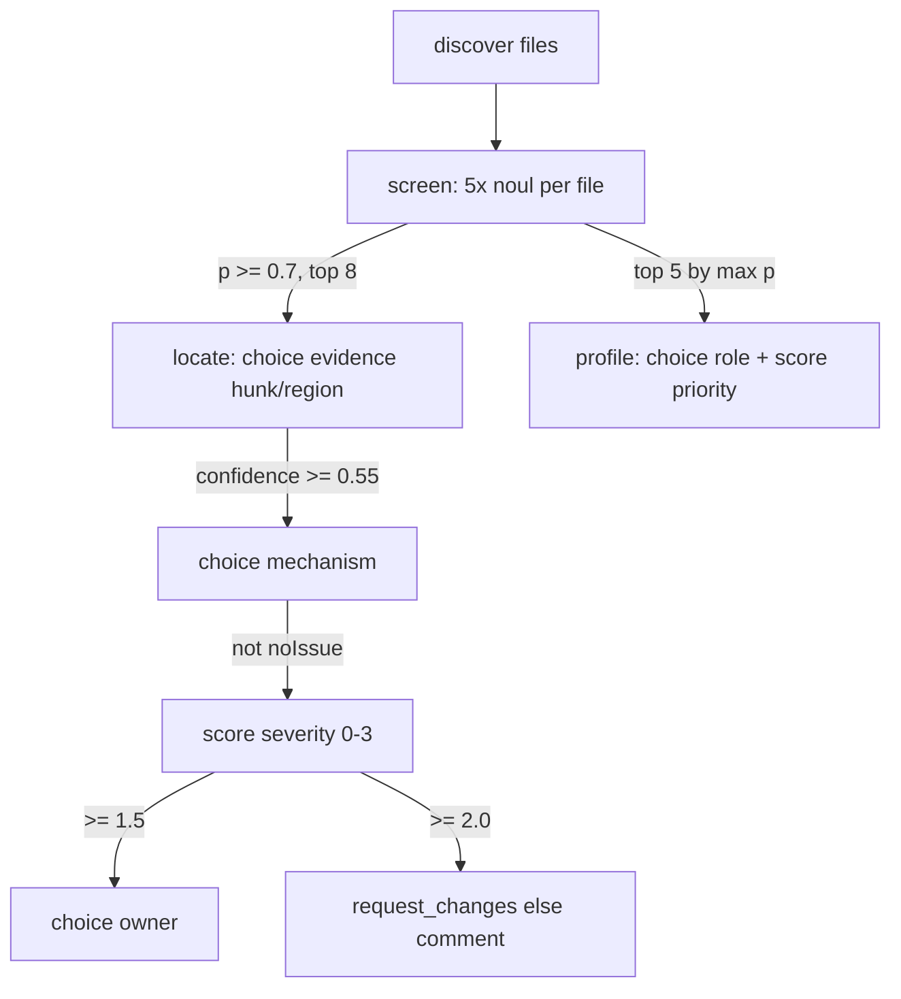

# Jev Judgment Pipeline

The funnel, as proven in `src/review/`:

## Stages

1. **Screen** (`screenFile` / `screenSourceFile`): five `noul` questions, one
   per dimension (correctness, security, reliability, compatibility, testGap).
   Each carries `inspect`/`focus`/`ignore` hints plus true/false criteria with
   examples and counterexamples. Test context rides along for testGap
   (`changedTests` in changes mode; `selectRelatedTests` + `compactTest` in
   codebase mode). Output: `Record<Dimension, number>`.
2. **Profile** (top 5 by max probability): `choice` file role
   (`changeTypes` for diffs, `fileRoles` for sources) + `score` review
   priority on `reviewPriorityRubric`. Cheap triage aid, not gating.
3. **Locate** (top 8 signals ≥ 0.7): `choice` strongest-evidence hunk
   (`parseHunks`, 80-line chunks for new files) or source region (80-line
   windows; screening uses 160-line windows, max-merged). `noMatch` fallback
   + `MIN_LOCATION_CONFIDENCE=0.55` kill weak attributions.
4. **Mechanism**: `choice` over per-dimension `mechanisms` vocabulary.
   `noIssue` kills the finding — the first precision gate.
5. **Severity**: `score` on `severityRubric` (0 none → 3 critical).
6. **Route** (severity ≥ 1.5): `choice` over `owners`
   (security/api/runtime/testing/maintainer). Action derives from severity:
   ≥ 2.0 → `request_changes`, else `comment`.

## Policy Lives in Code

`src/domain/config.ts`: `SCREEN_THRESHOLD`, `SEVERITY_MAX`, `ROUTE_SEVERITY`,
`BLOCKING_SEVERITY`, `MIN_LOCATION_CONFIDENCE`, `MAX_FOLLOW_UPS`,
`MAX_PROFILES`, `CONCURRENCY`, plus `dimensions`, `mechanisms`, rubrics,
`owners`, and file patterns. The model never sets budgets or thresholds.

## Report Shape

`ReviewReport` (`domain/types.ts`): mode, scope, dimensions, config snapshot,
`screenedFiles`, `contextFiles`, full probability `matrix`, `profiles`,
workflow funnel counts, and `findings` (file, line, dimension, mechanism +
confidences, severity + confidence, owner + confidence, action).

Known gap: findings carry no evidence excerpt, title, explanation, or
suggested fix — the single biggest actionability upgrade (see `roadmap.md`).
The dashboard currently renders raw mechanism keys.

## Cost Model

Per file: 1 screen call (5 questions batched). Per review: +5 profiles max,
+8 locate chains max (each up to 4 calls: evidence, mechanism, severity,
owner). Codebase mode multiplies screening by region count (160-line windows).
No caching yet — re-scans resend everything. Budgets are static globals;
per-dimension thresholds and value-of-information selection are roadmap items.
