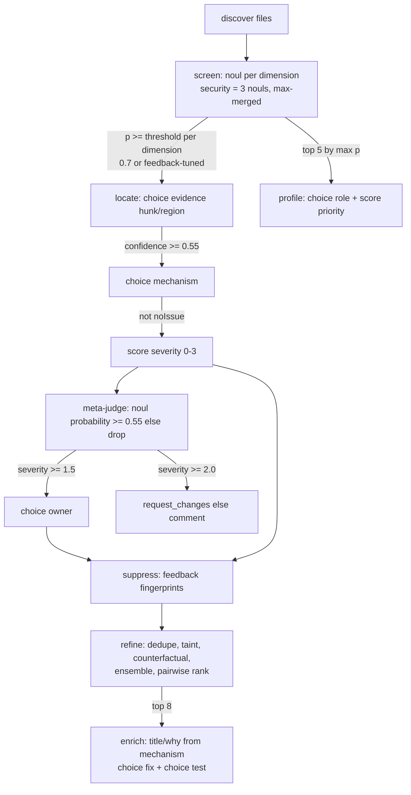

# Jev Judgment Pipeline

The funnel, as proven in `src/review/`:

```mermaid
flowchart TD
    D[discover files] --> S[screen: noul per dimension<br/>security = 3 nouls, max-merged]
    S -->|p >= threshold per dimension<br/>0.7 or feedback-tuned| L[locate: choice evidence hunk/region]
    S -->|top 5 by max p| P[profile: choice role + score priority]
    L -->|confidence >= 0.55| M[choice mechanism]
    M -->|not noIssue| V[score severity 0-3]
    V --> J[meta-judge: noul probability >= 0.55 else drop]
    J -->|severity >= 1.5| R[choice owner]
    J -->|severity >= 2.0| A[request_changes else comment]
    R & V --> X[suppress: feedback fingerprints]
    X --> F[refine: dedupe, taint, counterfactual,<br/>ensemble, pairwise rank]
    F -->|top 8| E[enrich: title/why from mechanism<br/>choice fix + choice test]
```

## Stages

1. **Screen** (`screenFile` / `screenSourceFile`): one `noul` per dimension
   (correctness, security, reliability, compatibility, testGap). The security
   dimension is split into three `noul`s — authz/injection/exposure,
   crypto/secrets, and misconfiguration — folded back by max-merge (see
   `docs/security-taxonomy.md`). Each carries `inspect`/`focus`/`ignore` hints
   plus true/false criteria with examples and counterexamples. Test context
   rides along for testGap (`changedTests` in changes mode;
   `selectRelatedTests` + `compactTest` in codebase mode). Changes mode also
   sends `file.base` alongside `file.patch` (correctness compares the two);
   codebase mode attaches 1-hop callers/callees (`neighbors`) resolved via the
   heuristic import graph in `adapters/imports.rs`. Output:
   `Record<Dimension, number>`.
2. **Profile** (top 5 by max probability): `choice` file role
   (`changeTypes` for diffs, `fileRoles` for sources) + `score` review
   priority on `reviewPriorityRubric`. Cheap triage aid, not gating.
3. **Locate** (every signal ≥ 0.7; unlimited by default, `--follow-ups N`
   re-imposes a per-dimension budget): `choice` strongest-evidence hunk
   (`parseHunks`, 80-line chunks for new files) or function-aware source
   region (`regions::function_regions`, a tree-sitter-free heuristic splitting
   at column-0 top-level declarations; oversized declarations and
   declaration-free files fall back to uniform windows; screening uses the
   same regions, max-merged). `noMatch` fallback
   + `MIN_LOCATION_CONFIDENCE=0.55` kill weak attributions.
4. **Mechanism**: `choice` over per-dimension `mechanisms` vocabulary.
   `noIssue` kills the finding — the first precision gate.
5. **Severity**: `score` on `severityRubric` (0 none → 3 critical).
6. **Meta-judge** (`meta::judge`): a second, independent skeptical `noul`
   ("does selectedEvidence concretely support this mechanism?"). Below
   `MIN_META_JUDGE_CONFIDENCE` the finding is dropped as an unsupported claim
   — the FP filter.
7. **Route** (severity ≥ 1.5): `choice` over `owners`
   (security/api/runtime/testing/maintainer). Action derives from severity:
   ≥ 2.0 → `request_changes`, else `comment`.
8. **Suppress**: each finding gets a line-independent `fingerprint` (file,
   dimension, mechanism, evidence text); fingerprints a reviewer hid from the
   dashboard are dropped before any further calls.
9. **Refine** (`review/refine`, skipped with `--no-refine`), mode-agnostic
   judgments over the finding plus `fileContext` (the file around the line)
   and `neighbors` (codebase mode):
   - **Dedupe** (#10): per file, in severity order, one `choice` "which
     nearby kept finding shares newFinding's root cause, or `distinct`?"
     over findings within `CLUSTER_LINE_WINDOW` lines. At
     `MIN_CLUSTER_CONFIDENCE` the finding folds into that one's `related`.
   - **Taint** (#13, injection-class security, top `MAX_TAINT`): `choice`
     source over `TAINT_SOURCES` + `noul` reaches-sink, then (if the sink is
     plausibly reached) `noul` sanitized-for-this-sink given that source.
     `exploitability = untrusted × reachesSink × (1 − sanitized)`; below
     `LOW_EXPLOITABILITY` a blocking finding is demoted to a comment.
   - **Counterfactual** (#14, top `MAX_COUNTERFACTUAL`): `choice` over
     `EXONERATING_FACTS` ("which single fact would make this a false
     positive?"), then a skeptical `noul` "does the context show it?". At
     `EXONERATION_DROP` the finding is dropped; otherwise the fact is kept
     for the reviewer.
   - **Ensemble** (#15, blocking findings, top `MAX_ENSEMBLE`): one request,
     one dimension-level `noul` per `ENSEMBLE_FOCI` perspective. A spread
     of `NEEDS_HUMAN_SPREAD` or a mean below `NEEDS_HUMAN_MEAN` sets
     `needsHuman`.
   - **Pairwise rank** (#12, top `PAIRWISE_TOP_K` by severity): a `choice`
     "fix which first?" for every pair (batched, order alternated against
     position bias), fit with Bradley-Terry; the top-K is re-ordered and gets
     `rank`.
   A failed refinement call keeps the finding unrefined and logs it.
10. **Enrich** (top 8 findings after refinement): `title` / `why` are
   derived deterministically from the classified mechanism; `fix` / `test`
   come from one narrow `choice` call each (`suggestedFix`, `suggestedTest`)
   over curated strategy vocabularies. Jev offers no free-text generation
   (only `noul`/`choice`/`score`), so "generation" is expressed as a
   `choice` whose selected label's description is the suggestion.

## Feedback

The dashboard records 👍 / 👎 / Hide per finding in `reviews/feedback.json`
(`MOMUS_FEEDBACK` overrides). The server fills file, dimension, mechanism,
and probability from the saved report; only the fingerprint and verdict come
from the browser, and cross-origin posts are refused. On the next run:

- **Suppression**: a fingerprint whose latest vote is Hide is dropped.
- **Threshold tuning** (`domain::feedback::tune_threshold`): per dimension,
  with at least `MIN_FEEDBACK_VOTES`, precision ≥ `HIGH_PRECISION` at the
  default lowers the threshold one step; precision below `TARGET_PRECISION`
  raises it to the lowest step that reaches the target (ceiling
  `MAX_TUNED_THRESHOLD`). Votes only exist above the old threshold, so it
  never drops more than one step. The applied values are in
  `config.screenThresholds`.

## Policy Lives in Code

`src/domain/policy.rs`: `SCREEN_THRESHOLD`, `SEVERITY_MAX`, `ROUTE_SEVERITY`,
`BLOCKING_SEVERITY`, `MIN_LOCATION_CONFIDENCE`, `MAX_PROFILES`, `CONCURRENCY`,
plus `dimensions`, `mechanisms`, rubrics, `owners`, and file patterns. The
model never sets budgets or thresholds; follow-ups are unlimited by default
and `--follow-ups N` re-imposes a cap in code.

## Report Shape

`ReviewReport` (`domain/report.rs`): mode, scope, dimensions, config snapshot,
`screenedFiles`, `contextFiles`, full probability `matrix`, `profiles`,
workflow funnel counts (including suppressed / clustered / exonerated /
needs-human), and `findings` (file, line, dimension, mechanism +
confidences, severity + confidence, owner + confidence, action, the
`evidence` excerpt, generated `title` / `why` / `fix` / `test`, and the
refinement results `fingerprint`, `related`, `rank`, `taint`,
`exoneration`, `ensemble`).

The dashboard renders each finding's evidence excerpt plus its generated
`title`, `why`, `fix`, and `test`, with filter/sort/search, per-file focus,
and copy-as-PR-comment.

The same report is also emitted as **SARIF 2.1.0** (`--sarif <path>`, for
GitHub code scanning) and archived per-revision under
`reviews/history/<sha>.<mode>.json` (`changes` or `codebase`, so a scan and
a diff review of one commit do not overwrite each other); the dashboard's
History view aggregates those snapshots into risk-over-time, hotspots, and
fix-latency. A file counts as resolved only when the most recent review that
screened it found nothing there.

## Cost Model

Per file: 1 screen call (5–7 questions batched — security is 3 sub-`noul`s).
Per review: +5 profiles max, +1 locate chain per followed signal (unlimited by
default; each up to 5 calls: evidence, mechanism, severity, meta-judge,
owner), then refinement: dedupe ≤ 1 call per finding with a nearby kept
finding, taint ≤ 2 × 12, counterfactual ≤ 2 × 12, ensemble ≤ 8, pairwise
⌈15 / 5⌉ = 3; then +1 enrich call per finding up to the top 8. Codebase mode multiplies
screening by region count (function-aware regions). No caching yet —
re-scans resend everything. Budgets are static globals; value-of-information
selection is a roadmap item.
